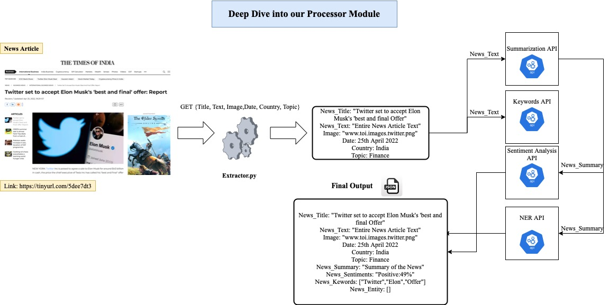

# FinalProject🎬
# News Aggregator📰 


# Overview:
News is one of the most important things in most peoples' lives. On most days of the week, something or the other is happening on a local, national and global level. Readers have a diverse diet of news across multiple subjects like political, civil, social-humanitarian interests, cultural interests, weather forecasts and a whole host of entertainment and sports topics. People get their news from a variety of sources from traditional sources like newspapers, television and radio to modern sources like news apps and social media. The vast amount of news stories makes it challenging for the readers to identify the latest stories and avoid reading about the same events. Readers nowadays prefer to consume news in a short period of time. To address the above difficulties the need for an automated system arises which could analyze, filter and recommend fresh news according to readers' preferences.

# User Story:


1. As a user I don't have much time to go through entire article and just want to see a summarized version of the news
2. As a user I am only interested in trending topics
3. As a user I want to see the reaction of people and what people are talking about that domain on twitter with the news as well
4. As a user I am looking for a particular question and want to see all related articles to it
5. As a user I want a aggregate place where news from all channels are present

# Access our Streamlit Application:

https://share.streamlit.io/shahparth0007/finalprojectstreamlit/main/Pages/streamlit.py

# Architecture


**1. News Fetcher and Twitter Fetcher**

These modules are responsible for collecting the news articles and social network's streams (input data). The news fetcher periodically monitors a list of RSS feeds. In order to effectively crawl the RSS feeds, the component will use the Python Scrapy framework.

The Twitter fetcher collects the posts (tweets) using the streaming Twitter API and tracks a dynamically selected list of keywords that is based on our trend detection component.

**2. Extractor**

The output of the news fetcher component, as illustrated, is provided to the extractor component. This component is responsible for processing the HTML data and extracting the main content of the article automatically. It does so by using the python readability

**3. Pre processor**

The Pre Processor module performs various NLP tasks that include tokenization, dependency parsing, sentence splitting and named entity recognition. For these NLP tasks, we use the open source library Spacy4.


 # Addressing the 5 V's of Big Data
#### Volume: We will have a huge dataset as the scrappers will be running on news websites and twitter

#### Velocity: News agencies all over the world constantly generate new content for a variety of topics, ranging from local social incidents to global events

#### Variety: The news article are from variety of news publications and data types

#### Veracity: Our preprocessor module will keep a check on veracity

#### Value: After all preprocessing the value is what customers will look on screen


Checkout our Application Demo: 


 # Our Processor Module:
 
 
 
 # How to run our Project
 
 ## 1) To run Streamlit
 
 ```
 git clone https://github.com/shahparth0007/FinalProjectStreamlit.git
 
 pip3 install -m requirements.txt
 
 cd Pages
 
 streamlit run streamlit.py
 ```
 
 Username: Parth Passoword: parth for streamlit 
 ## 2) To run FASTApi for preprocessor
 
 ```
 git clone https://github.com/BigDataArchitecture/FinalProject.git
 
 pip3 install -m requirements.txt
 
 cd NewsAggregation
 cd Preprocessor
 python3 main.py
 
 ```
  ## 3) To Save the data in MongoDB 
  
  1) Create a mongoDB account @ https://www.mongodb.com
  2) Create a Database called "Newsmonitor"
  3) Get the connection link from "Security > Database Access"
  4) Replace the connection Link in "google_news.py"
 ``` 
 cd NewsAggregation
 cd Preprocessor
 python3 google_news.py
 ```
 

# Deployment Details:

Language: Python, HTML, CSS
Container: Docker, AWS ECR
Cloud ecosystems: AWS, MongoDB Atlas
Cloud tools: AWS Lambda, AWS Cloudwatch, AWS Gateway
Tools for analysis:Anaconda Spyder, MongoDB Atlas
Other tools and frameworks: FastAPI, Pytest, Streamlit, Airflow
 
 # References:
 Sentiment Analysis: https://arxiv.org/pdf/2007.02238.pdf
 
 
